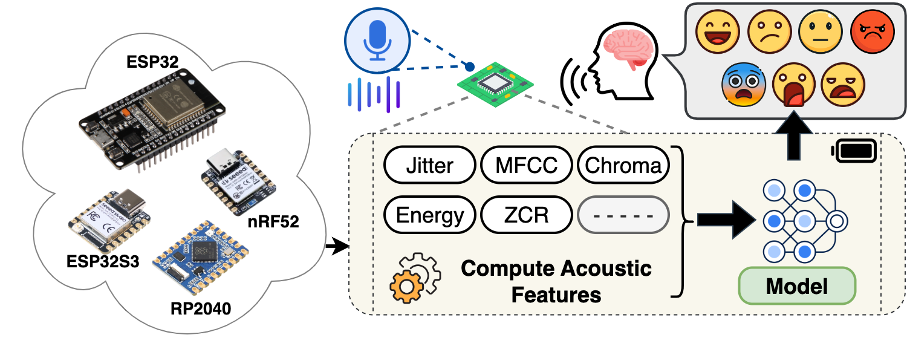

# embedded-audio-emotion

Audio-based emotion recognition has many applica- tions in human-computer interaction, mental health assessment, and customer service analytics. This project presents a machine learning-based on-device emotion (i.e., anger, disgust, fear, hap- piness, neutrality, sadness, and surprise) recognition from audio for low-cost embedded devices. We show the influence of the speaker’s mental state on various acoustic features, such as intensity, shimmer, etc. However, classifying the emotions from audio is challenging, as these emotions sound ambiguous for different speakers. Our extensive evaluation with lightweight machine learning models indicates an overall F1-score of 61% with below 50 ms response time and 256 KB memory usage in modern embedded devices.

<p align="center">
      
</p>


# Installation
To set up the project on your local system, execute the following commands:
```bash
git clone https://github.com/prasenjit52282/embedded-audio-emotion.git
cd embedded-audio-emotion
pip install -r requirements.txt
```

# Dataset
Download the dataset required for training and testing from Kaggle. Ensure that the data is structured as follows:
```
embedded-audio-emotion
└──speech-emotion-recognition-en
   └── Crema
   └── Ravdess
   └── Savee
   └── Tess
```

# Generating the refined dataset for training models
After downloading the dataset and organizing it in the specified structure, generate the necessary CSV files by running the following command:
```bash
python dataset_generator.py
``` 
This script will produce two files:

audio_dataframe.csv

extracted_acoustic_features.csv

These files will serve as inputs for training the models.

# Training the models
To train the emotion recognition models, use the generated dataset and run the following command:
```bash
python train.py generated_dataset/extracted_acoustic_features.csv
```
The trained models will be saved in the models directory.

# Using the Models to Test Audio
Once the models are trained, you can test the emotion recognition on various audio files. Use the following command:
```bash
python predictor.py <audio_file_path> <model_path>
```
Replace <audio_file_path> with the path to the audio file you want to test and <model_path> with the path to the trained model.

# Directory Structure
The project directory is organized as follows:
```
embedded-audio-emotion
└── emlearn
└── demo_audio_files
    └── DC_h05.wav
└── logs
└── webdemo
└── dataset_generator.py
└── em_model.py
└── extractor.py
└── modeling.py
└── power_profile.py
└── predictor.py
└── processing.py
└── README.md
└── requirements.txt
└── train.py
```

